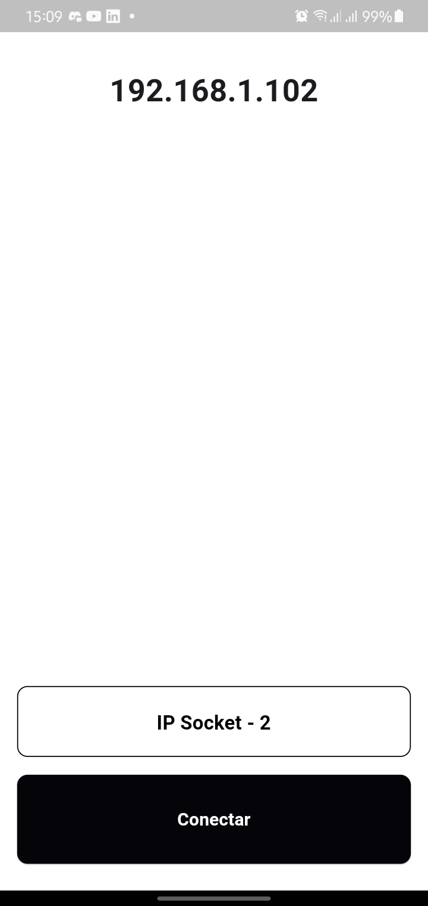
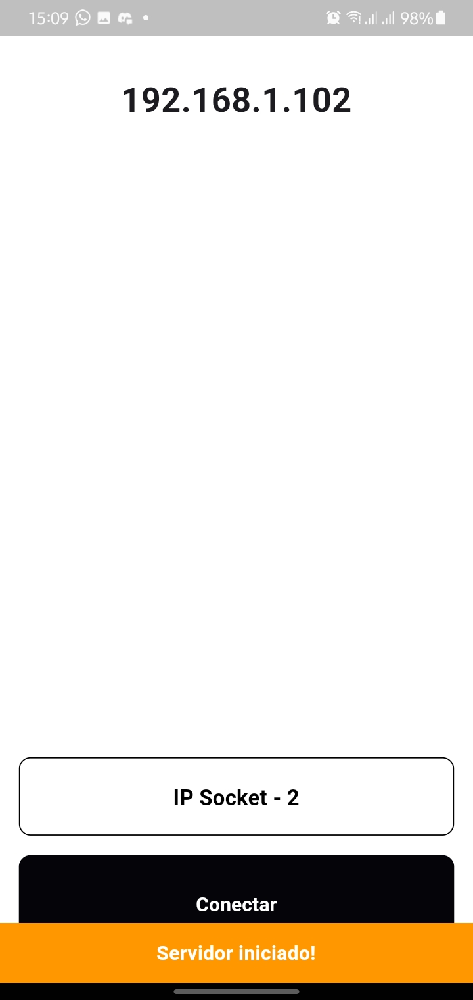
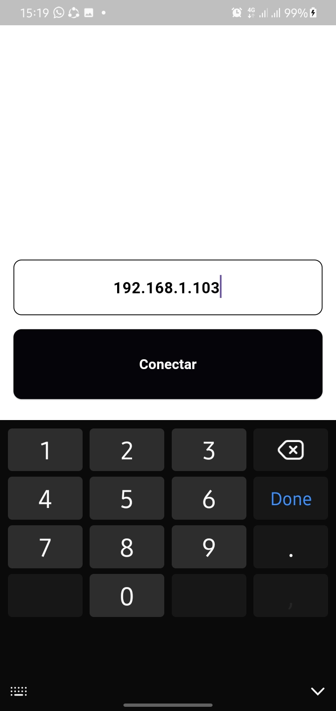
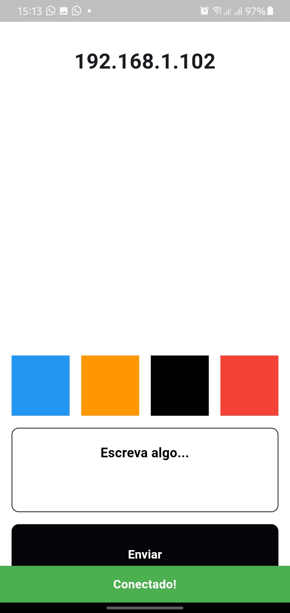

# Socket-io-communication
Make two apps communicate on a local network using the Socket solution📲

## Getting started
To run the projects, you need to configure Flutter on your machine. If you haven't already set up Flutter, you can follow this YouTube link to help you do so: https://www.youtube.com/watch?v=0OG44O8oYp8
## 1 step:
Once you have your flutter environment set up, the next step is to put the two cell phones on the same network.
## 2 step:
Run the apps for each cell phone. There are two flutter projects at the root of the repository. In this case, access the socket_1 project and run it on one of the phones, then access socket_2 and also run it on the other phone. Run the "flutter run" command directly, or access "run and debug" in your VSCode and debug.
## 3 step:
After the apps build, enter the ip address that will appear at the top of socket_2 into socket_1, to establish a communication tunnel from one end to the other.
## 4 step:
If the connection is established, a ScaffoldMessenger will appear saying "Connected". Then play around trying to communicate and changing the colors of socket_1 on socket_2.

<<<<<<< HEAD
## Screenshots

=======
>>>>>>> 22c9613ae97592b7ed6bca4a4f7f7629d7540c5e
## Points:
Projects based on communication between devices on a local network offer a number of advantages, including low cost, low latency, privacy, total control and flexibility to meet specific project needs. This approach can be especially useful in contexts where global connectivity is not required or where internet connectivity is limited.

What's more, there are a range of solutions that can be made based on this concept, such as: 

- __Local Multiplayer Game__
- __Remote Control for Devices__
- __Localized Chat__
- __Simple File Sharing__
- __Interactive Presentation Application and more...__
